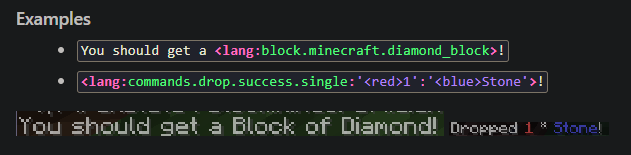
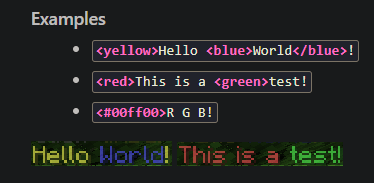

## The 1.18.2 Update

We are now releasing initial builds for 1.18.2. These have been tested by our team over the last few days and we were able to iron out quite a few issues, but you should still be careful. These are early builds, they may contain breaking issues, backups are absolutely mandatory! **After you update, you cannot downgrade your world back to 1.18.1 or lower again!**

As always, we would like to thank everybody who contributed to this update, be it by contributing code, reporting issues or just discussing changes with us in voice chat and cheering us on.

In particular, we would like to thank the following developers:

- [@kennytv](https://github.com/sponsors/kennytv)
- [@Machine Maker](https://github.com/sponsors/Machine-Maker)
- [@jmp](https://github.com/sponsors/jpenilla/)
- [@kashike](https://github.com/sponsors/kashike)
- [@Spottedleaf](https://www.patreon.com/Spottedleaf)
- [@electronicboy](https://www.paypal.com/paypalme/ShaneFreeder)

You can also support the PaperMC project itself, you can find more information about that here: https://papermc.io/sponsors

## For Developers

**MiniMessage included in Paper API**
Since MiniMessage is now stable, we have decided to include it in the Paper API. For those who don’t know what MiniMessage is yet; it’s a simple, user-friendly, string representation of Minecraft’s chat components, perfect for use in config files. You can learn more about it [here](https://docs.adventure.kyori.net/minimessage/), and be sure to check out [the Web UI](https://webui.adventure.kyori.net) to start playing with MiniMessage now!

Note: While MiniMessage is now packaged with the API and available for plugins to use, it is not currently used by Paper itself. In the future, we plan to migrate all configurable messages over to MiniMessage, allowing for much more control over the styling of configurable messages!

**StructureLocateEvent replacement**
Due to a lot of internal restructuring in Vanilla, the StructureLocateEvent has been replaced by the StructuresLocateEvent. It holds a list of ConfiguredStructures (as opposed to just one StructureType previously). The old event is no longer fired, so if you used it, you should update the API usage as soon as possible.

## Docs

Another thing we would like to note is that we are working on a new documentation site for the PaperMC organization, which will replace the various documentation sites currently in use. We are looking to open the floor for discussion, ideas, suggestions, and contributions, so please keep an eye on the [#docs channel](https://discord.gg/papermc) for more information!
